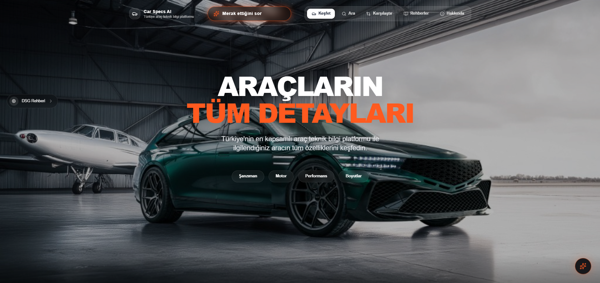

# 🚗 Araçların Tüm Detayları - Car Specs Platform

Araçların detaylı teknik özelliklerini görüntülemek için tasarlanmış kapsamlı bir platform. Modern Go backend, React frontend ve yapay zeka destekli chatbot ile güçlendirilmiştir.



## ✨ Özellikler

### 🔍 Araç Veritabanı ve Arama
- **Detaylı Araç Veritabanı**: Motor, şanzıman, boyutlar ve daha fazlası dahil olmak üzere kapsamlı teknik özellikler
- **Gelişmiş Arama**: Marka, model, yıl, yakıt tipi ve şanzıman türüne göre filtreleme
- **Karşılaştırma Aracı**: Farklı araç trim'lerinin yan yana karşılaştırılması
- **Nesil Bazlı Organizasyon**: Araçlar nesil kodları ile organize edilmiş (örn: Audi A3 8P, 8V, 8Y)

### 🤖 Yapay Zeka Destekli Chatbot
- **Otomotiv Uzman Asistanı**: Google Gemini 1.5 Flash ile güçlendirilmiş AI chatbot
- **Gerçek Zamanlı Web Araması**: Tavily Search API entegrasyonu ile güncel bilgilere erişim
- **Domain Özel Bilgi**: Otomotiv mühendisliği ve servis teknisyeni uzmanlığı
- **Akıllı Doğruluk Kontrolleri**: Motor tipine özel validasyon (benzinli/dizel ayrımı)
- **Türkçe Destek**: Tam Türkçe dil desteği ile yanıtlar

### 🎨 Modern Kullanıcı Arayüzü
- **Sürükleyici Tasarım**: Glassmorphism efektleri ve yüksek kaliteli görseller ile modern dark mode
- **Etkileşimli Rehberler**: 
  - Şanzıman Rehberi (Otomatik, Manuel, DSG, CVT)
  - Motor Terimleri Sözlüğü
  - DSG Varyantları Detaylı Kılavuzu
- **Responsive Design**: Tüm cihazlarda mükemmel görünüm
- **Smooth Animasyonlar**: Framer Motion ile akıcı geçişler

### 📊 Veri Senkronizasyonu
- **Güncel Veriler**: CarQuery API ile otomatik senkronizasyon
- **4 Seviyeli Veri Yapısı**: Brand → Model → Generation → Trim hiyerarşisi

## 🛠️ Teknoloji Yığını

### Backend
- **Go (Golang)**: Yüksek performanslı API sunucusu
- **SQLite + GORM**: Hafif ve hızlı veritabanı yönetimi
- **Standard Library HTTP**: Minimal bağımlılık ile native routing

### Frontend
- **React 18**: Modern UI geliştirme
- **TypeScript**: Type-safe kod yazımı
- **Vite**: Ultra hızlı build tool
- **Tailwind CSS**: Utility-first CSS framework
- **Framer Motion**: Smooth animasyonlar
- **Lucide React**: Modern icon kütüphanesi

### AI Chatbot Microservice
- **Python 3.x**: FastAPI ile yüksek performanslı API
- **LangChain**: AI agent orkestrayonu
- **Google Gemini 1.5 Flash**: Son teknoloji LLM
- **Tavily Search API**: Gerçek zamanlı web araması
- **FastAPI + Uvicorn**: Async API framework

## 🚀 Kurulum ve Çalıştırma

### Gereksinimler

- **Go** 1.22 veya üstü
- **Node.js** 18+ ve npm
- **Python** 3.8+ (Chatbot için)
- **API Keys** (Chatbot için):
  - Google AI API Key (Gemini)
  - Tavily API Key

### 📦 Hızlı Başlangıç (Önerilen)

Proje kök dizinindeki `start.bat` dosyasına çift tıklayın. Bu, bağımlılıkları kontrol edecek ve backend ile frontend servislerini otomatik olarak başlatacaktır.

```bash
# Windows için:
start.bat
```

### 🔧 Manuel Kurulum

#### 1. Backend API (Go)

```bash
cd backend
go mod tidy

# Sunucuyu çalıştır
go run cmd/api/main.go

# İlk kurulumda veri çekmek için:
go run cmd/api/main.go -scrape
```

**Backend çalışıyor:** `http://localhost:8080`

#### 2. Frontend (React)

```bash
cd frontend
npm install
npm run dev
```

**Frontend çalışıyor:** `http://localhost:5173`

#### 3. AI Chatbot Microservice (Python)

```bash
cd python-service

# Virtual environment oluştur (önerilen)
python -m venv venv
venv\Scripts\activate  # Windows
# source venv/bin/activate  # Linux/Mac

# Bağımlılıkları yükle
pip install -r requirements.txt

# Ortam değişkenlerini yapılandır
# .env dosyası oluşturun ve API anahtarlarınızı ekleyin:
# GOOGLE_API_KEY=your_google_api_key
# TAVILY_API_KEY=your_tavily_api_key

# Servisi çalıştır
python main.py
```

**Chatbot API çalışıyor:** `http://localhost:8000`

## 📁 Proje Yapısı

```
car-specs/
├── backend/                 # Go API sunucusu
│   ├── cmd/api/            # Ana uygulama
│   ├── internal/           # İç paketler
│   │   ├── database/       # Veritabanı yapılandırması
│   │   ├── handlers/       # HTTP handlers
│   │   ├── models/         # Veri modelleri
│   │   ├── repository/     # Veritabanı katmanı
│   │   └── service/        # İş mantığı katmanı
│   ├── migrations/         # Veritabanı migrasyonları
│   └── pkg/                # Harici paketler
│       └── carquery/       # CarQuery API client
│
├── frontend/               # React uygulaması
│   ├── src/
│   │   ├── components/     # Yeniden kullanılabilir componentler
│   │   ├── pages/          # Sayfa componentleri
│   │   ├── services/       # API servisleri
│   │   └── types/          # TypeScript tipleri
│   └── public/             # Statik dosyalar
│
├── python-service/         # AI Chatbot microservice
│   ├── main.py            # FastAPI uygulaması
│   ├── requirements.txt   # Python bağımlılıkları
│   └── .env               # API anahtarları (git'de değil)
│
└── data/                   # Paylaşılan veri kaynakları
```

## 🔌 API Endpoints

### Araç Verileri API (Backend - Port 8080)

#### Brands (Markalar)
- `GET /api/brands` - Tüm markaları listele
- `POST /api/brands` - Yeni marka oluştur
- `GET /api/brands/{id}` - Marka detayları
- `PUT /api/brands/{id}` - Marka güncelle
- `DELETE /api/brands/{id}` - Marka sil

#### Models (Modeller)
- `GET /api/brands/{brandId}/models` - Markaya göre modelleri listele
- `GET /api/models/{id}` - Model detayları
- `POST /api/models` - Yeni model oluştur

#### Generations (Nesiller)
- `GET /api/models/{modelId}/generations` - Modele göre nesilleri listele
- `GET /api/generations/{generationId}` - Nesil detayları

#### Trims (Donanımlar)
- `GET /api/generations/{generationId}/trims` - Nesile göre trim'leri listele
- `GET /api/trims/{id}` - Trim detayları
- `POST /api/trims` - Yeni trim oluştur

#### Diğer
- `GET /api/search` - Gelişmiş arama (query parametreleri ile)
- `GET /api/featured` - Ana sayfa için öne çıkan araçlar
- `GET /api/vehicles` - Tüm araçlar (legacy endpoint)
- `POST /api/chat` - Go backend üzerinden chatbot proxy
- `GET /health` - Sunucu sağlık kontrolü

### AI Chatbot API (Python Service - Port 8000)

- `POST /ask` - Chatbot'a soru sor
  ```json
  {
    "message": "Audi A3 8V 1.4 TFSI motorunda DPF var mı?"
  }
  ```
  
- `GET /health` - Chatbot servisi sağlık kontrolü

## 🤖 AI Chatbot Özellikleri

### Akıllı Domain Bilgisi
- **Motor Tipi Tanıma**: Benzinli/dizel motor tiplerini otomatik ayırt eder
- **Terminoloji Doğruluğu**: Yanlış terim kullanımını engeller (örn: benzinli motorlarda DPF söylemez)
- **Teknik Açıklamalar**: Karmaşık terimleri parantez içinde Türkçe açıklar

### Web Araması Entegrasyonu
Şu sorularda otomatik web araması yapar:
- Kronik sorunlar ve arızalar
- Kullanıcı yorumları ve deneyimleri
- Gerçek yakıt tüketimi verileri
- Güncel piyasa fiyatları

### Prompt Engineering
- Sıfır sıcaklık (temperature=0) ile hallüsinasyonları minimize eder
- Katı sistem promptları ile domain sınırları belirler
- Format güvenliği (Markdown çıktı kontrolü)
- "Bilmiyorum" yanıtını destekler (uydurma yapmaz)

## 📸 Ekran Görüntüleri

### Ana Sayfa
Modern dark theme ve glassmorphism efektleri ile şık tasarım

### Araç Karşılaştırma
Yan yana karşılaştırma ile detaylı teknik özellik analizi

### AI Chatbot
Akıllı otomotiv asistanı ile soru-cevap

### Şanzıman Rehberi
Detaylı teknik açıklamalar ve görsellerle etkileşimli rehber

## 🔐 Güvenlik ve Yapılandırma

### Ortam Değişkenleri

**Backend (.env):**
```env
PORT=8080
DB_PATH=./vehicles.db
```

**Python Service (.env):**
```env
GOOGLE_API_KEY=your_google_gemini_api_key_here
TAVILY_API_KEY=your_tavily_search_api_key_here
```

> ⚠️ **Uyarı**: `.env` dosyaları `.gitignore`'da olmalıdır. API anahtarlarınızı asla repository'ye commit etmeyin!

## 🧪 Geliştirme

### Frontend Development

```bash
cd frontend

# Development mode
npm run dev

# Production build
npm run build

# Preview production build
npm run preview

# Linting
npm run lint
```

### Backend Development

```bash
cd backend

# Run tests
go test ./...

# Run with auto-reload (requires air)
air

# Build binary
go build -o api cmd/api/main.go
```

### Python Service Development

```bash
cd python-service

# Run with auto-reload
uvicorn main:app --reload --port 8000

# View logs in verbose mode (main.py AgentExecutor verbose=True)
python main.py
```

## 🗺️ Roadmap

- [ ] **Kullanıcı Hesapları**: Favori araçlar ve karşılaştırma kaydetme
- [ ] **Gelişmiş AI**: Görsel tanıma ve araç öneri sistemi
- [ ] **Mobil Uygulama**: React Native ile iOS/Android desteği
- [ ] **Çoklu Dil**: İngilizce dahil çoklu dil desteği
- [ ] **Sosyal Özellikler**: Kullanıcı yorumları ve değerlendirmeleri
- [ ] **Performans Metrikleri**: 0-100 km/s, maksimum hız grafikleri
- [ ] **Yakıt Ekonomisi Hesaplayıcı**: Gerçek dünya tüketim tahmini

## 🐛 Bilinen Sorunlar

Herhangi bir bug bulursanız lütfen GitHub Issues'da rapor edin.

## 🤝 Katkıda Bulunma

1. Fork edin
2. Feature branch oluşturun (`git checkout -b feature/AmazingFeature`)
3. Değişikliklerinizi commit edin (`git commit -m 'Add some AmazingFeature'`)
4. Branch'inizi push edin (`git push origin feature/AmazingFeature`)
5. Pull Request açın

## 📄 Lisans

Bu proje MIT Lisansı altında lisanslanmıştır. Detaylar için `LICENSE` dosyasına bakın.

## 👨‍💻 Geliştirici

**emirh** - [GitHub Profile](https://github.com/emirh)

## 🙏 Teşekkürler

- [CarQuery API](http://www.carqueryapi.com/) - Araç verileri için
- [Google Gemini](https://deepmind.google/technologies/gemini/) - AI chatbot için
- [Tavily](https://tavily.com/) - Web arama için
- Tüm açık kaynak katkıda bulunanlara

---

<div align="center">

**⭐ Projeyi beğendiyseniz yıldız vermeyi unutmayın! ⭐**

Made with ❤️ in Turkey 🇹🇷

</div>
